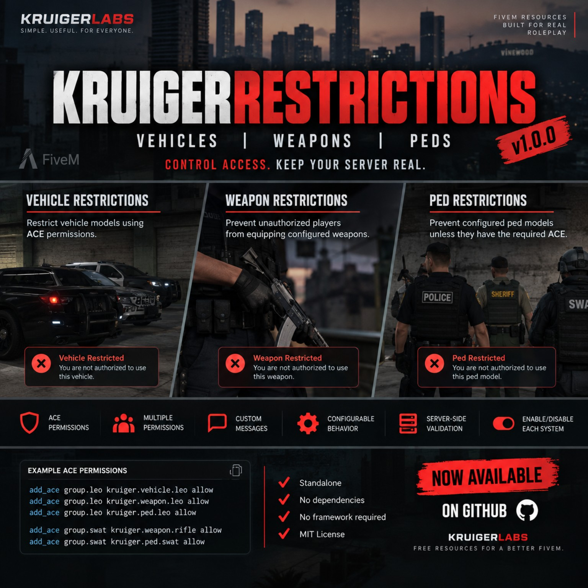

# KruigerRestrictions — Free FiveM Restrictions Script

KruigerRestrictions is a **standalone FiveM restriction script** for controlling vehicles, weapons, player ped models, and clothing with standard FiveM ACE permissions. It does not require ESX or QBCore.

## Features
- FiveM vehicle restrictions
- FiveM weapon restrictions
- Ped model restrictions
- Clothing component and prop restrictions
- Separate male/female clothing configuration
- Specific texture or all-texture restrictions
- Multiple allowed ACE permissions per item
- Custom denial messages
- Server-side permission checks
- Independently enabled restriction modules
- No framework or dependencies required

## Installation
1. Place `KruigerRestrictions` in your resources folder.
2. Add `ensure KruigerRestrictions` to `server.cfg`.
3. Configure the files inside `config/`.
4. Add the required ACE permissions.
5. Restart the resource or server.

## ACE examples
```cfg
add_ace group.leo kruiger.vehicle.leo allow
add_ace group.leo kruiger.weapon.leo allow
add_ace group.leo kruiger.ped.leo allow
add_ace group.leo kruiger.clothing.leo allow
```

## Documentation
- Full documentation: https://kruigerlabs.xyz/docs/free-scripts/kruigerrestrictions
- FiveM scripts: https://kruigerlabs.xyz/fivem
- Documentation center: https://kruigerlabs.xyz/docs/

## License
Licensed under the **Kruiger Labs Community License v1.0**. See `LICENSE` for complete terms. Copyright © 2026 Kruiger Labs LLC.

## Kruiger Labs

**Project Page:** https://kruigerlabs.xyz/projects/KruigerRestrictions/
